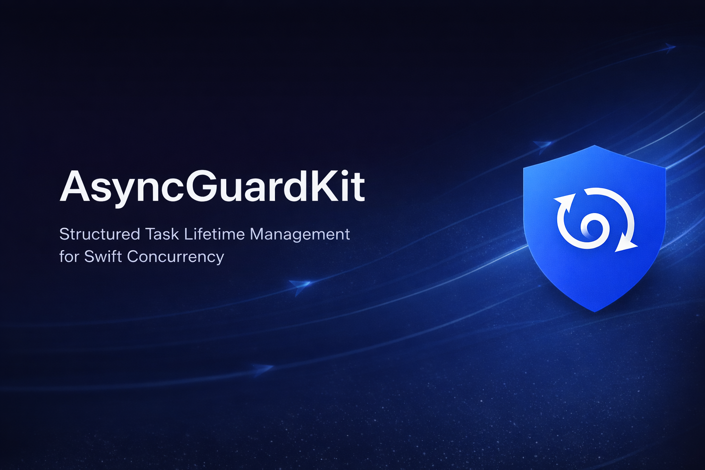

<div align="center">



# AsyncGuardKit

**Structured task lifetime management for Swift.**

[](https://swift.org)
[](https://developer.apple.com/ios/)
[](https://developer.apple.com/macos/)
[](LICENSE)
[](https://github.com/your-org/AsyncGuardKit/actions)

[Installation](#installation) · [The Problem](#the-problem) · [API](#api) · [Examples](#real-world-patterns) · [Architecture](#architecture) · [Design](#design-principles) · [Contributing](#contributing)

</div>

---

AsyncGuardKit eliminates the manual cancellation boilerplate that developers write — and forget — when using Swift concurrency. It gives you three focused, composable tools: **automatic lifetime binding**, **single-flight deduplication**, and **retry with backoff** — each designed to feel native to Swift.

---

## Why this exists

Swift concurrency is excellent. Managing task lifetimes manually is not.

Every Swift developer has written a version of this:

```swift
class FeedViewModel: ObservableObject {
    func load() {
        Task {
            let items = try await api.fetchFeed()
            self.items = items  // 💥 crashes if ViewModel was released
        }
        // This task has no owner.
        // It runs after the ViewModel is gone.
        // It mutates deallocated state.
        // Everyone writes this. Everyone gets burned by it.
    }
}
```

And every team with a networking layer has shipped a version of this:

```swift
// User opens a screen. 10 views load simultaneously.
// Each detects an expired token. Each calls refreshToken().
// Your auth server gets 10 simultaneous refresh requests.
// Race conditions ensue. Nobody can reproduce it in development.
```

These are not edge cases. They are the **default outcome** of Swift concurrency without a lifetime strategy. AsyncGuardKit gives you that strategy — three primitives, zero dependencies, an API that reads like Swift.

---

## The problem

### Problem 1 — Tasks outlive their owner

```swift
// ❌ Unowned task — crashes or corrupts state
class ProfileViewModel: ObservableObject {
    func load() {
        Task {
            let profile = try await api.fetchProfile()
            self.profile = profile  // self may already be gone
        }
        // No way to cancel. No owner. No cleanup.
    }
}
```

### Problem 2 — Token refresh stampede

```swift
// ❌ 10 callers → 10 network requests → race conditions
func fetchData() async throws -> Data {
    let token = try await auth.refreshToken()  // called 10× simultaneously
    return try await api.fetch(token: token)
}
```

### Problem 3 — Hand-rolled retry

```swift
// ❌ Inconsistent, error-prone, not cancellation-aware
var attempts = 0
while attempts < 3 {
    do {
        return try await api.call()
    } catch {
        attempts += 1
        try await Task.sleep(nanoseconds: 1_000_000_000 * UInt64(attempts))
        // Does this propagate CancellationError? Depends who wrote it.
    }
}
```

---

## The solution

```swift
// ✅ Lifetime-bound task — zero cleanup code
class ProfileViewModel: ObservableObject {
    private let lifetime = AsyncLifetime()

    func load() {
        AsyncTask {
            let profile = try await api.fetchProfile()
            await MainActor.run { self.profile = profile }
        }
        .bind(to: lifetime)
        // When ProfileViewModel deallocates → task cancelled. Automatically.
    }
}
```

```swift
// ✅ Single-flight deduplication — one request, all callers get the result
let token = try await withSingleFlight(key: "token-refresh") {
    try await auth.refreshToken()
}
```

```swift
// ✅ Structured retry — cancellable, composable, testable
let data = try await retry(attempts: 3, backoff: .exponential(base: .seconds(1))) {
    try await api.call()
}
```

---

## Installation

### Swift Package Manager

Add to your `Package.swift`:

```swift
dependencies: [
    .package(url: "https://github.com/your-org/AsyncGuardKit", from: "1.0.0")
]
```

Add to your target:

```swift
.target(
    name: "MyApp",
    dependencies: [
        .product(name: "AsyncGuardKit", package: "AsyncGuardKit")
    ]
)
```

Then import:

```swift
import AsyncGuardKit
```

### Xcode

**File → Add Package Dependencies** → paste the repository URL → select version → **Add Package**.

### Requirements

| Platform | Minimum |
|---|---|
| iOS | 16.0 |
| macOS | 13.0 |
| tvOS | 16.0 |
| watchOS | 9.0 |
| Swift | 5.9 |
| Xcode | 15.0 |

---

## API

### `AsyncTask`

A unit of async work with an explicit, declared lifetime strategy. Every `AsyncTask` requires you to choose one of three strategies — there is no silent default. Lifetime intent is visible in the code.

```swift
// Strategy 1 — bind to object lifetime (recommended)
// Cancelled automatically when `lifetime` deallocates.
AsyncTask { await doWork() }
    .bind(to: lifetime)

// Strategy 2 — store in a cancellable set (manual control)
// Cancelled when you call cancellables.cancelAll().
AsyncTask { await doWork() }
    .store(in: &cancellables)

// Strategy 3 — detached (explicit fire-and-forget)
// Runs to completion. Use for logging, analytics.
AsyncTask { await Analytics.log(.screenViewed) }
    .detached()
```

**With priority:**

```swift
AsyncTask(priority: .userInitiated) {
    try await api.fetchCriticalData()
}
.bind(to: lifetime)
```

---

### `AsyncLifetime`

Cancels all bound tasks when it deallocates. Declare it as a `let` property — it lives and dies with its owner.

```swift
class FeedViewModel: ObservableObject {
    @Published var items: [Item] = []
    private let lifetime = AsyncLifetime()  // one line

    func load() {
        AsyncTask { self.items = try await api.fetchFeed() }
            .bind(to: lifetime)
        // ↑ Cancelled when FeedViewModel is released.
        //   No deinit. No cancelAll(). Nothing to forget.
    }

    func refresh() {
        lifetime.cancelAll()  // cancel in-flight, restart fresh
        AsyncTask { self.items = try await api.fetchFeed() }
            .bind(to: lifetime)
    }
}
```

---

### `Set<AnyCancellable>`

Combine-familiar manual cancellation. Same muscle memory, no Combine dependency.

```swift
var cancellables = Set<AnyCancellable>()

AsyncTask { await loadFeed() }.store(in: &cancellables)
AsyncTask { await loadAds() }.store(in: &cancellables)

cancellables.cancelAll()  // cancel and clear
```

---

### `withSingleFlight(key:operation:)`

Execute an operation exactly once for a given key. All concurrent callers for the same key join the in-flight operation and receive the same result — or the same error.

Named following Apple's `with*` convention (`withTaskGroup`, `withCheckedContinuation`) to make scoping semantics immediately recognizable.

```swift
// One network request. All concurrent callers share the result.
let token = try await withSingleFlight(key: "token-refresh") {
    try await authClient.refreshAccessToken()
}

// Typed keys prevent collisions in large systems
enum APIKey: Hashable {
    case tokenRefresh
    case userProfile(id: String)
    case feedPage(cursor: String)
}

let profile = try await withSingleFlight(key: APIKey.userProfile(id: userID)) {
    try await api.fetchProfile(userID)
}
```

---

### `retry(attempts:backoff:shouldRetry:operation:)`

Retry with configurable backoff. Stops immediately on `CancellationError`, including during a backoff delay.

```swift
// Exponential: 1s → 2s → 4s
let data = try await retry(attempts: 3, backoff: .exponential(base: .seconds(1))) {
    try await api.fetchData()
}

// Fixed: 500ms between each attempt
let result = try await retry(attempts: 5, backoff: .fixed(.milliseconds(500))) {
    try await database.query()
}

// Conditional: only retry on specific errors
let response = try await retry(attempts: 3, backoff: .exponential(base: .seconds(1))) {
    try await api.post(request)
} shouldRetry: { error in
    (error as? URLError)?.code == .networkConnectionLost
}
```

**`RetryBackoff` options:**

| Case | Behaviour |
|---|---|
| `.none` | Retry immediately, no delay |
| `.fixed(.milliseconds(500))` | Same delay before every attempt |
| `.exponential(base: .seconds(1))` | `base × 2ⁿ` — doubles after each failure |

---

## Real-world patterns

### SwiftUI search ViewModel

```swift
@MainActor
class SearchViewModel: ObservableObject {
    @Published var results: [SearchResult] = []
    @Published var isLoading = false

    private let lifetime = AsyncLifetime()

    func search(query: String) {
        lifetime.cancelAll()  // cancel previous search

        AsyncTask {
            self.isLoading = true
            defer { self.isLoading = false }

            do {
                self.results = try await withSingleFlight(key: "search:\(query)") {
                    try await SearchAPI.search(query: query)
                }
            } catch is CancellationError {
                // User typed again — expected, not an error
            }
        }
        .bind(to: lifetime)
    }
}
```

### UIKit ViewController with retry

```swift
class FeedViewController: UIViewController {
    private let lifetime = AsyncLifetime()

    override func viewWillAppear(_ animated: Bool) {
        super.viewWillAppear(animated)

        AsyncTask {
            let feed = try await retry(
                attempts: 3,
                backoff: .exponential(base: .seconds(1))
            ) {
                try await FeedAPI.fetch()
            }
            await MainActor.run { self.render(feed) }
        }
        .bind(to: lifetime)
    }

    override func viewDidDisappear(_ animated: Bool) {
        super.viewDidDisappear(animated)
        lifetime.cancelAll()
    }
}
```

### Authenticated networking layer

```swift
class AuthenticatedAPIClient {

    func request<T: Decodable>(_ endpoint: Endpoint) async throws -> T {
        // Token refreshed exactly once regardless of concurrent callers
        let token = try await withSingleFlight(key: "auth-token") {
            try await tokenStore.refreshIfNeeded()
        }

        return try await retry(
            attempts: 3,
            backoff: .exponential(base: .milliseconds(500)),
            shouldRetry: { ($0 as? URLError)?.isTransient == true }
        ) {
            try await self.perform(endpoint, authorization: token)
        }
    }
}

private extension URLError {
    var isTransient: Bool {
        [.networkConnectionLost, .timedOut, .notConnectedToInternet].contains(code)
    }
}
```

---

## Architecture

```
┌──────────────────────┐        ┌──────────────────────┐
│    Raw Async Call    │        │   Parallel Requests  │
└──────────┬───────────┘        └──────────┬───────────┘
           │                               │
           ▼                               ▼
┌──────────────────────┐        ┌──────────────────────┐
│  Execution Context   │        │  SingleFlight        │
│  (caller's actor,    │        │  Deduplication       │
│   no silent hops)    │        │  (actor-backed)      │
└──────────┬───────────┘        └──────────┬───────────┘
           │                               │
           └───────────────┬───────────────┘
                           ▼
               ┌───────────────────────┐
               │   Scoped Task         │
               │   Management          │
               │                       │
               │   AsyncLifetime       │
               │   AnyCancellable      │
               └───────────┬───────────┘
                           │
                           ▼
               ┌───────────────────────┐
               │   Concurrency         │
               │   Policies            │
               │                       │
               │   retry / backoff     │
               └───────────┬───────────┘
                           │
                           ▼
               ┌───────────────────────┐
               │   AsyncTask           │
               │                       │
               │   Owns Task<Void,Never>│
               │   Enforces strategy   │
               │   declared at site    │
               └───────────┬───────────┘
                           │
                           ▼
               ┌───────────────────────┐
               │   Swift Concurrency   │
               │   Runtime             │
               └────┬────┬────┬────┬───┘
                    │    │    │    │
         ┌──────────┘    │    │    └──────────────┐
         ▼               ▼    ▼                   ▼
  ┌──────────┐  ┌──────────┐  ┌──────────┐  ┌──────────┐
  │  Task    │  │ Cancel   │  │ Error    │  │  Debug   │
  │Completion│  │Propagate │  │Propagate │  │Diagnostics│
  └──────────┘  └──────────┘  └──────────┘  └──────────┘
```

### Layer responsibilities

| Layer | Responsibility |
|---|---|
| **Execution Context** | Preserves caller's actor. Never silently hops. |
| **SingleFlight Registry** | Actor-backed map of `(key, type) → Task`. New callers join rather than duplicate. Cleaned up on completion or failure. |
| **Scoped Task Management** | `AsyncLifetime` — `deinit` cancels. `AnyCancellable` — you control when. |
| **Concurrency Policies** | `retry` — cancellation-aware loop with pluggable `RetryBackoff`. Free functions, not wrapper types. |
| **AsyncTask** | Owns the underlying `Task`. Enforces that every task declares its lifetime strategy. Cancels defensively in `deinit` if strategy was never declared. |
| **Debug Diagnostics** | `os.Logger` events. Gated by `#if DEBUG` + `debugLogging` flag. Zero cost in release. |

---

## Why this approach

### Why `deinit`-based cancellation?

The alternative — manual `cancelAll()` in `deinit` — requires tracking every task as a stored property. It's verbose, error-prone, and routinely forgotten. By attaching cancellation to an `AsyncLifetime` object that shares its owner's lifecycle, cancellation becomes a structural guarantee rather than a coding discipline.

This pattern is directly inspired by Combine's `AnyCancellable`, which proved that lifecycle-bound cancellation is the right default for asynchronous streams. AsyncGuardKit applies the same model to Swift concurrency tasks.

### Why free functions for `withSingleFlight` and `retry`?

Apple uses free functions for coordination primitives: `withTaskGroup`, `withCheckedContinuation`, `withUnsafeContinuation`. This convention signals that the function establishes a scope with well-defined entry and exit semantics. A static method on a facade (`AsyncGuard.singleFlight`) obscures that signal and adds indirection without benefit.

### Why `AnyCancellable` instead of a protocol existential?

Swift cannot make `any Protocol` conform to `Hashable`, which `Set` requires. A concrete wrapper type — identical to Combine's approach — is the correct solution. It also gives stable `ObjectIdentifier`-based identity without requiring conforming types to implement `Hashable` themselves.

### Why not an actor for `AsyncTask`?

Actors serialize access via suspension points. A task wrapper implemented as an actor would add unnecessary awaits to operations that are already thread-safe by construction. `AsyncTask` uses `NSLock` only for the minimal ownership-transfer flag — no suspension, no reentrancy risk.

---

## Debug diagnostics

Enable structured logging during development:

```swift
// AppDelegate or @main
#if DEBUG
AsyncGuard.configure(.init(debugLogging: true))
#endif
```

Events appear in **Console.app** and the **Xcode debug console**:

```
[main]       AsyncTask.created
[main]       AsyncTask.boundToLifetime
[background] withSingleFlight.started    key=token-refresh
[background] withSingleFlight.joined     key=token-refresh
[background] withSingleFlight.completed  key=token-refresh
[background] retry.failed  attempt=1  error=URLError(networkConnectionLost)
[background] retry.succeeded  attempt=2
[main]       AsyncLifetime.cancelledAll  count=3
[main]       AsyncLifetime.deallocated
```

All logging is compiled out entirely in release builds — `#if DEBUG` eliminates every call site. Zero runtime cost in production.

---

## Design principles

**Explicit over implicit.** AsyncGuardKit never silently switches actor context, auto-cancels tasks without declaration, or makes scheduling decisions on your behalf. Every behavior is visible at the call site.

**Lifetime binding over manual cleanup.** The `deinit`-based model means correctly managed tasks require zero cleanup code. The absence of a `deinit` override is not a bug — it is the correct outcome.

**Free functions for scoped coordination.** `withSingleFlight` and `retry` follow Apple's `with*` convention, making their scoping semantics immediately recognizable to any Swift developer.

**No dependencies.** Only the Swift standard library, Foundation, and `os.Logger`. Nothing pulled in transitively.

**Testable by design.** Every component exposes what tests need. `SingleFlightRegistry.inFlightCount()` for deduplication assertions. `AsyncLifetime.count` for binding assertions. `retry`'s `shouldRetry` predicate injectable in tests.

---

## License

AsyncGuardKit is available under the MIT license. See [LICENSE](LICENSE) for details.

---

## Contributing

Contributions are welcome. Please read the following before opening a pull request.

**Before contributing:**
- Open an issue to discuss significant changes before implementing
- Check existing issues and pull requests to avoid duplicate work

**Standards:**
- All public API must include full doc comments following the existing style
- All changes must include tests — new behaviour requires new tests, bug fixes require regression tests
- Run `swift test` and ensure all tests pass
- No force unwraps, no global mutable state, no blocking APIs

**Pull request checklist:**
- [ ] Tests added or updated
- [ ] Documentation updated
- [ ] `swift test` passes locally
- [ ] No new compiler warnings

---

<div align="center">
<sub>Built with care for the Swift open-source community.</sub>
</div>
